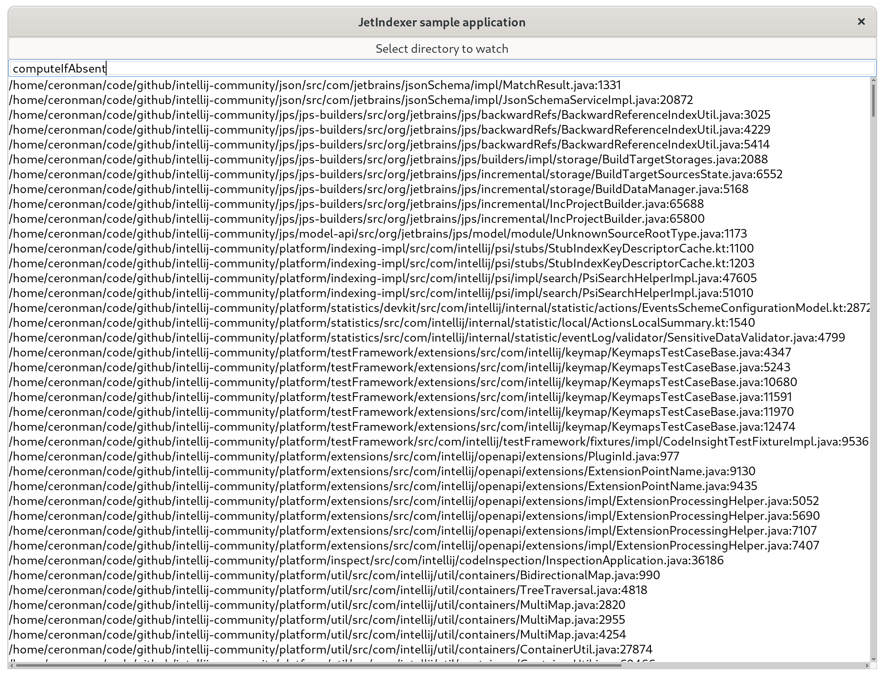

# JetIndexer

A text search engine library for Kotlin.

JetIndexer takes a list of directories and it indexes text files contained in those
recursively. Additionally, it can watch those directories for changes and update
the index accordingly. Once the index is built it is possible to search text
in the indexed files in a fast way.

The indexation process can be customized by providing a custom `Tokenizer` and/or
`QueryResolver`. Filtering which files should be indexed can be configured by
providing a `IndexingFilter` object.

## How to use

First, create `JetIndexer` object with the list of paths of the directories that you
want to index. You should also pass a `Tokenzier`, a `QueryResolver` and a `IndexingFilter`:

```kotlin
val path = Paths.get("path/to/dir")
val indexer = JetIndexer(
    listOf(path),
    TrigramTokenizer(),
    TrigramSubstringQueryResolver(),
    DefaultIndexingFilter(),
)
indexer.index()
``` 

In this example a `TrigramTokenizer` will be used, which will split the text in trigrams
For example, if a file contains the word *kotlin*. This would be tokenized as 
`("kot", "otl", "tli", "lin")`. This allows for searching substrings in the index using the
corresponding `TrigramSubstringQueryResolver`.

The `DefaultIndexingFilter` will index only files that look like text and skip binary formats.

Optionally, you can start a file watcher that will observer the filesystem and react to files
added or updated and add them to the index. This can be done using the `indexer.watch()` method.
This method blocks, so it's recommended to called from a coroutine:

```kotlin
launch {
    indexer.watch()
}
```

To search the index, just use the `indexer.query()` method:

```kotlin
val results = indexer.query("foo")
for (result in results) {
    println("${result.term} -> ${result.path}:${result.position}")
}
```

To stop the file watching just call:

```kotlin
indexer.stopWatching()
```

## Customizing the indexing and search

To provide a custom tokenizer, just implement the `Tokenizer` interface:

```kotlin
interface Tokenizer {
    fun tokenize(path: Path): Sequence<Token>
}
```

To provide custom search capabilites, implement the `QueryResolver` interface:

```kotlin
interface QueryResolver {
    fun search(index: InvertedIndex, query: String): List<QueryResult>
}
```

To provide a custom filter to decide which files to index and which not, implement the `IndexingFilter`
interface:

```kotlin
interface IndexingFilter {
    fun shouldIndexFile(path: Path): Boolean
    fun shouldIndexDir(path: Path): Boolean
}
```

## How to compile

The project uses Maven for building and dependency management. To build just run

```
mvn clean package
```

To run the tests:

```
mvn test
```

## Sample program



There is a simple example program using Java Swing that demostrate how the library is used.

To run it just run:

```
mvn clean package
java -jar sampleapp/target/sampleapp-1.0-SNAPSHOT-jar-with-dependencies.jar
```


## Architecture

JetIndexer uses an [inverted index](https://en.wikipedia.org/wiki/Inverted_index) to store a table mapping
tokens to **posting lists**. A posting list is a list of files and the corresponding integer positions where
the token appears in that file. The inverted index starts as an in-memory `HashMap` and after reaching certain
size it's written to disk in a shard. A shard then stores a map of token to offsets in the file where the posting 
lists can be loaded.

### Posting List format

To reduce memory usage, the posting lists are stored compressed in byte buffers. The format of a posting list 
looks like:

```
[doc id 1]      : varint
[num positions] : varint
[pos 1]         : delta varint
[pos 2]         : delta varint
...
[pos n]:        : delta varint
[doc id 1]
[num positions] : varint
[pos 1]         : delta varint
...
...
```

The integers representing the document IDs, number of positions and positions are encoded
in 
[variable byte encoding (aka VarInt)](https://nlp.stanford.edu/IR-book/html/htmledition/variable-byte-codes-1.html) 
to save space.

To increase efficiency, the positions are stored as deltas. So for example of for a given 
file the list of positions `[1, 7, 20]`. These are stored as `[1, 6, 14]`. Smaller integers allow 
for better compression.

### Shards

To avoid using too much memory, indexes are written in segments or shards. Each shard contains the 
*token to posting* table for a collection of files. Shards are saved to disk and loaded when necessary.

Using shards allow for efficiently adding, updating or deleting files from the index. Whenever new files 
are added, they are just added to a new shard.

The shards are completely immutable, which helps for concurrent searches. When files are modified, the old
file ids are removed without modifying the shards. These removed documents are then filtered out during the
search process. Then the files are added again, with a new document id in a new shard.

This makes update operations very cheap, but it causes *garbage* to remain in the shards for some time.
a compacting and re-indexing process could be implemented in the future.

### Concurrency

Most of the actual data in the index is stored in immutable shards, which facilitates concurrent access.
However, the actual list of documents and the list of shards are stored in mutable structures. To be thread
safe the index uses a read-write lock to guard any modifications of these structures.

### Trigrams

The library is flexible enough to use any kind of tokenizer. There is a `Tokenizer` interface that can be
used for such purpose. Besides the trivial `WhiteSpaceTokenizer` included, a trigram bazes tokenizer is included.
This allows to use the technique described here 
[https://swtch.com/~rsc/regexp/regexp4.html](https://swtch.com/~rsc/regexp/regexp4.html):


Using the corresponding `TrigramSubstringQueryResolver` it is possible to search for arbitrary substrings in the
corpus of the index.

It is also possible to implement a `QueryResolver` that searches the corups using regex, following the same 
principles explained in the article linked above. But unfortunatelly, this is not implemented yet.

